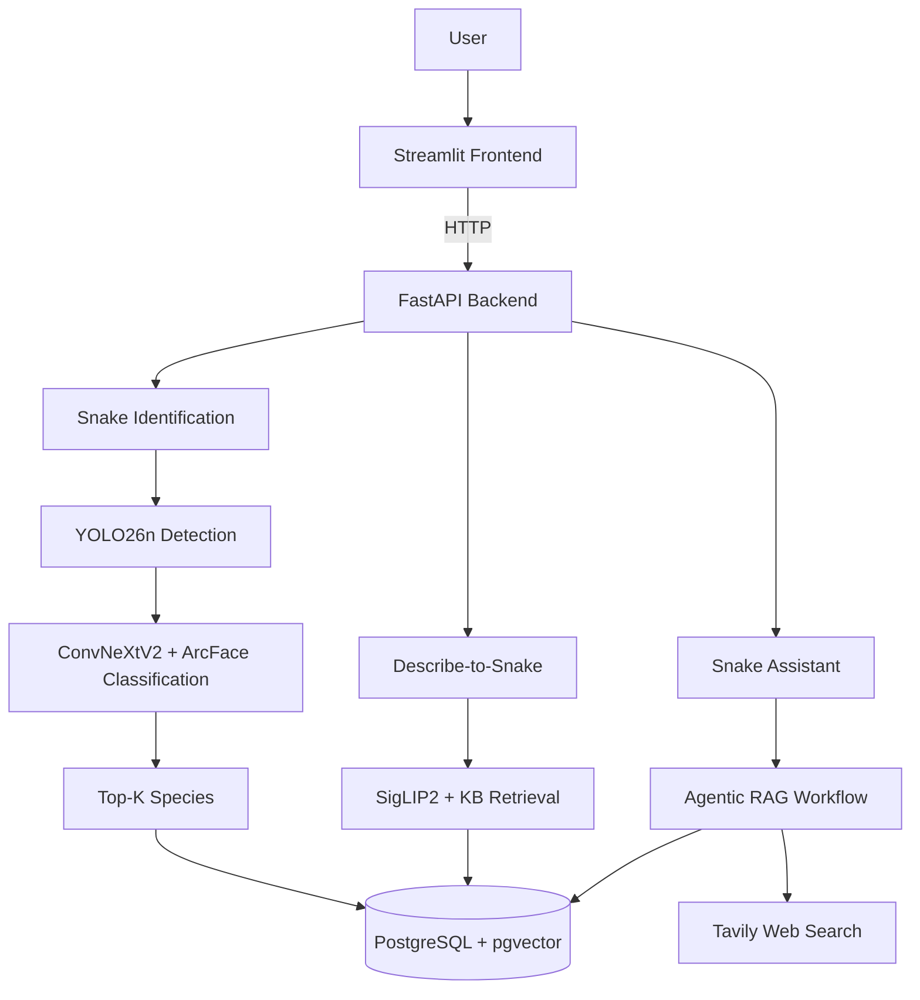

# 🐍 SnakeGuard AI

> An end-to-end AI system for identifying and understanding 109 snake species found in Vietnam.

## Overview

SnakeGuard AI is developed around 109 Vietnamese snake species using data from **SnakeCLEF2023** and **VietnameseSnake**, together with snakebite and first-aid guidance from the **Vietnam Ministry of Health**. It combines computer vision, multimodal retrieval, and RAG to help users identify snakes, explore species information, and access relevant guidance in potential snakebite situations.

The system is designed for both practical safety support and educational exploration of Vietnam's snake biodiversity.

## Key Features
- 🐍 **Snake Detection** — Detect snakes in uploaded images using **YOLO26n**.
- 🎯 **Species Classification** — Classify detected snakes with **ConvNeXtV2 + ArcFace** and return Top-K predictions.
- 💬 **Agentic RAG Assistant** — Answer snake-related questions using retrieval, reranking, optional web search, and grounded generation.
- 🔎 **Describe-to-Snake Retrieval** — Match natural-language descriptions to likely species using **SigLIP2** and structured species data.
- 🤖 **Multi-Provider LLM Support** — Support **Groq, OpenAI, Gemini, and DeepSeek** through configurable backend settings.
- 📚 **PostgreSQL + pgvector** — Store species data, vector embeddings, knowledge documents, and prediction history.
- 🌐 **Service-Based Architecture** — Streamlit communicates with AI services exclusively through **FastAPI**.
- 🐳 **Dockerized Stack** — Run frontend, backend, PostgreSQL/pgvector with **Docker**.
- ✅ **Automated CI** — Use **GitHub Actions, Ruff, and Pytest** for linting, testing, and Docker build validation.

## Chatbot Supported Topics

- 🐍 **Snake Species Information** — Answer questions about characteristics, identification, behavior, and other information related to the 109 supported snake species.
- 🩹 **Snakebite First Aid** — Provide general first-aid guidance and safety information for potential snakebite situations.
- 💬 **General Q&A** — Support general conversations and questions, although responses may not reflect the latest information depending on the selected LLM and available knowledge.

## System Architecture



## Project Structure

```text
snakeguard-ai/
├── .github/
│   └── workflows/          # GitHub Actions CI workflows
├── .streamlit/             # Streamlit configuration
├── backend/                # FastAPI backend, APIs, services, database and RAG logic
├── frontend/               # Streamlit user interface
├── ml/                     # Model training, evaluation and inference utilities
├── models/                 # YOLO and classification model artifacts
├── data/                   # Processed metadata, embeddings and runtime data
├── scripts/                # Data preparation, seeding and embedding scripts
├── tests/                  # Unit and integration tests
├── infra/
│   └── docker/             # Dockerfiles, entrypoints and bootstrap scripts
├── alembic/                # Database migration history
├── .dockerignore           # Docker build exclusions
├── .gitignore              # Git exclusions
├── alembic.ini             # Alembic configuration
├── docker-compose.yml      # Full-stack Docker orchestration
├── pyproject.toml          # Ruff and Python tooling configuration
├── requirements.txt        # Local development dependencies
└── README.md               # Project documentation
```

## Model Evaluation

### Snake Detection

| Metric | Result |
|---|---:|
| Precision | 96.78% |
| Recall | 93.07% |
| mAP@50 | 96.83% |
| mAP@50-95 | 82.43% |
| Inference Time | 4.50 ms/image |

### Snake Species Classification

| Metric | Result |
|---|---:|
| Validation Top-1 Accuracy | 83.13% |
| Test Top-1 Accuracy | 83.02% |
| Test Top-3 Accuracy | 92.09% |
| Track 1 Score (Official Style) | 90.64% |

The SnakeGuard recognition pipeline combines **YOLO26n detection** with a **ConvNeXtV2-Base + ArcFace classifier + Safety Loss**. On the 109-species evaluation set, the classification stage achieved a **Track 1 score of 90.64%** using the official-style SnakeCLEF metric.


## Technology Stack

| Layer | Technology | Role |
|---|---|---|
| Computer Vision | YOLO26n, ConvNeXtV2, PyTorch | Snake detection and species classification |
| Multimodal Retrieval | SigLIP2, pgvector | Description-to-snake retrieval |
| RAG / LLM | BGE-M3, BGE Reranker, LangGraph, Tavily | Retrieval, reranking, web search, and agentic workflow |
| LLM Providers | Groq, OpenAI, Gemini, DeepSeek | Answer generation |
| Backend | FastAPI, Pydantic, SQLAlchemy, Alembic | API, validation, ORM, and migrations |
| Database | PostgreSQL + pgvector | Structured data and vector storage |
| Frontend | Streamlit | User interface |
| Infrastructure | Docker, GitHub Actions | Containerization and CI |
| Quality | Ruff, Pytest | Linting and testing |

## Getting Started

### 1. Clone the repository

```bash
git clone <repository-url>
cd snakeguard-ai
```

### 2. Configure environment variables

Create a `.env` file in the project root directory:

```text
snakeguard-ai/
├── .env
├── docker-compose.yml
├── backend/
├── frontend/
└── ...
```

Add the required configuration and API keys to `.env`, for example:

```bash
DATABASE_URL=...
LLM_PROVIDER=...
LLM_API_KEY=...
LLM_MODEL=...
TAVILY_API_KEY=...
```

### 3. Start the application

```bash
docker compose up -d --build
```

The application will automatically initialize the required database data, models, and reference assets when needed.

### 4. Open the application

```text
Frontend: http://localhost:8501
Backend:  http://localhost:8000
Swagger:  http://localhost:8000/docs
```

> PostgreSQL runs internally through Docker Compose. Port `5432` is exposed only for database access/debugging if needed.

### Stop the application

```bash
docker compose down
```

## Testing

Run linting:

```bash
ruff check backend frontend ml scripts tests
```

Run tests:

```bash
pytest -q
```


## Limitations

- The recognition system is limited to the 109 snake species included in the current dataset and may misclassify unseen species.
- Prediction quality can decrease with blurry, dark, occluded, or very small snake images.
- Describe-to-Snake retrieval has not yet been fine-tuned on a snake-specific dataset, which may reduce species-level retrieval accuracy.
- RAG responses depend on the quality of retrieved context and the availability of external LLM and web-search providers.
- Although YOLO26n is lightweight, reliable classification across 109 snake species currently requires a relatively large ConvNeXtV2-Base classifier, increasing model size, memory usage, and inference cost.

## Future Work

- Improve model efficiency, robustness, and snake-specific retrieval performance.
- Add geolocation and map-based hospital search.
- Integrate hospital and antivenom information to provide more practical support in potential snakebite emergencies.

## Disclaimer

SnakeGuard AI is intended for educational and informational purposes. Snake identification results and first-aid information should not be treated as a substitute for professional medical advice or emergency services.